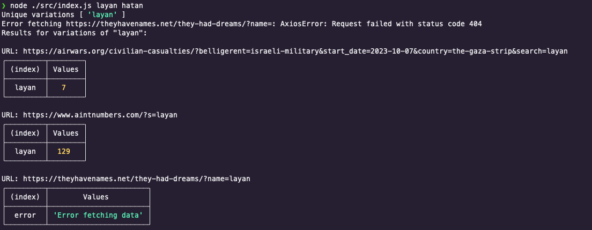

# BirdsOfGaza-basic-name-search-tool

Basic name search tool for Birds of Gaza, that automates searching for martyred children by name in multiple sites. It saves some time for researchers, instead of switching between multiple tabs and combing through Google search results, they pop up the terminal, and run the tool with the name they are searching for. The tool searches in multiple sites then tells the researcher which sites has that name, or a variation of it.

At this moment, the tool supports searching the following sites:

- [AintNumbers](https://www.aintnumbers.com/)
- [AirWars](https://airwars.org/conflict/israel-and-gaza-2023/)

With plans to add the following websites:

- [TheyHaveNames](https://theyhavenames.net/they-had-dreams/)
- [LetThemGrowUp](https://letthemgrowup.com/children-we-already-lost-en/)
- [OurGaza](https://ourgaza.com/martyrs)
- [DCI-Palestine](https://www.dci-palestine.org/)
